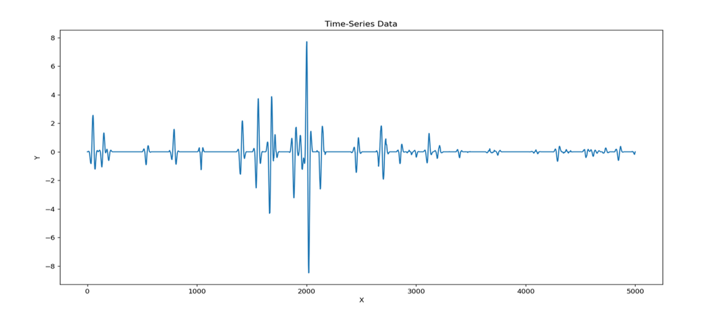

# Time-series-analysis
To clone this repository in your local machine 
```
git clone https://github.com/Onaga08/Time-series-analysis.git

```

<h2>Introduction</h2>
This project was developed by us while training at SeisData Processing and Interpretation Center (SPIC), ONGC, Mumbai
The objective of this project is to locate the area of interests pointing to the location and depth of Hydrocarbon wells in both onshore and offshore sites, using Seismic data gathered as time-series.

<h2>What is Time series?</h2>
<ul>
      <li>Time series data in seismic data processing serves as the foundation for understanding the temporal variations in ground motion and unlocking insights about the subsurface, enabling effective exploration and management of oil and gas resources.</li>
      <li>By analysing time series data, seismic data processing experts can extract critical information about the subsurface geological structures and the presence of potential hydrocarbon reservoirs. These time-dependent variations in ground motion, captured by the time series data, provide valuable insights into the behaviour and characteristics of the subsurface.</li>
</ul>


 	
 	

