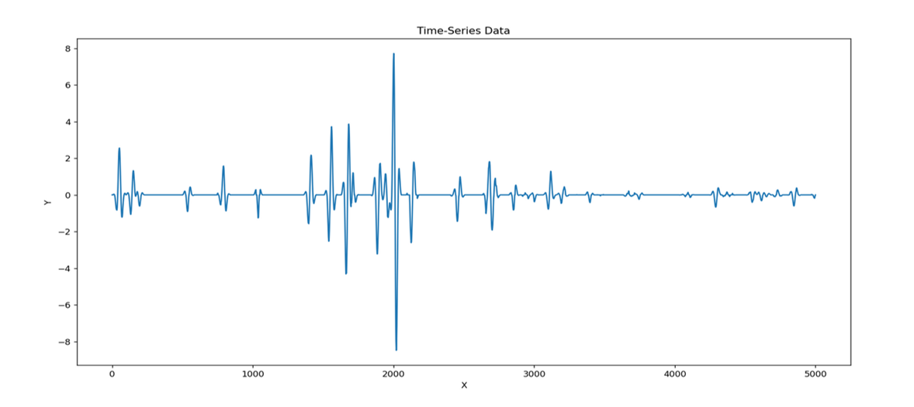
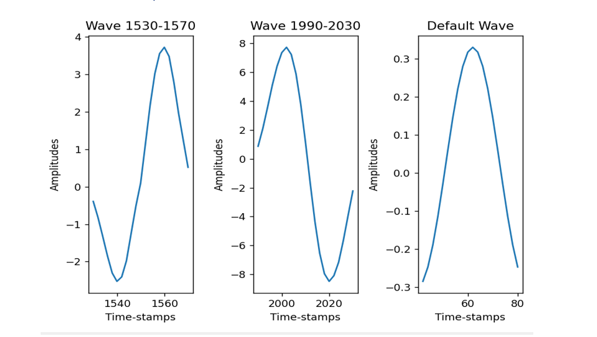
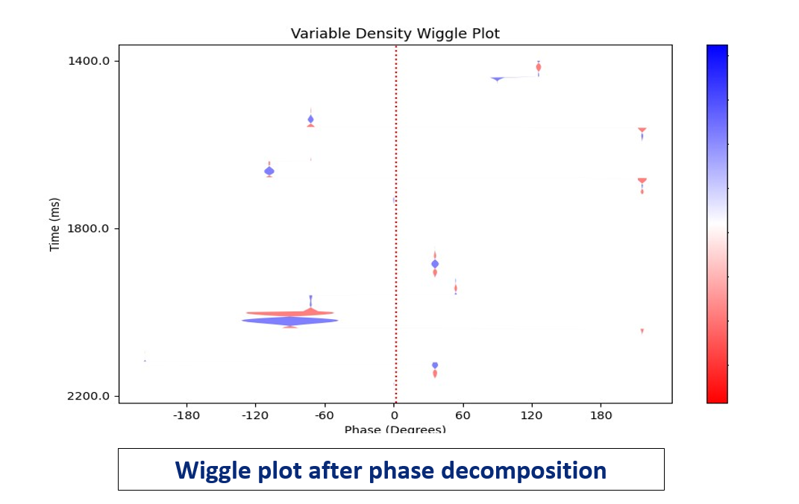

# Time-series-analysis
To clone this repository in your local machine 
```
git clone https://github.com/Onaga08/Time-series-analysis.git

```

<h2>Introduction</h2>
This project was developed by us while training at SeisData Processing and Interpretation Center (SPIC), ONGC, Mumbai
The objective of this project is to locate the area of interests pointing to the location and depth of Hydrocarbon wells in both onshore and offshore sites, using Seismic data gathered as time-series.

<h2>What is Time series?</h2>
<ul>
      <li>Time series data in seismic data processing serves as the foundation for understanding the temporal variations in ground motion and unlocking insights about the subsurface, enabling effective exploration and management of oil and gas resources.</li>
      <li>By analysing time series data, seismic data processing experts can extract critical information about the subsurface geological structures and the presence of potential hydrocarbon reservoirs. These time-dependent variations in ground motion, captured by the time series data, provide valuable insights into the behaviour and characteristics of the subsurface.</li>
</ul>


 	
<h2>Problem Statement</h2>
<p>
 	The presence of waves with inconsistent phases in the recorded data hampers the interpretation and analysis process. There is a need to develop filtering techniques that can effectively isolate and extract waves with consistent phases. This will enable accurate interpretation of the seismic data and improve the identification of hydrocarbon reservoirs.
</p>
<p>
      This complex phase filtering problem was proposed to be solved by comparing the trace data against a zero phase ideal wavelet. The objective was to achieve a phase lag of approximately ± 90 degrees, effectively highlighting the areas of interest. With unwavering diligence and dedication, we worked to overcome this challenge, aiming to provide invaluable insights and essential support to SPIC, ONGC in their determined pursuit of hydrocarbon exploration.
</p>

<h3> The different wavelets taken from Trace-Data is visualized to show correlation between Trace-Data and Ideal 
Wavelet
</h3>



### Note - The main methodology and logic is not shared under NDA with ONGC and the Authors of this project.

## Result - 
-  	Since the raw data we received was larger than the comparison wavelet, we sliced the raw data to match the size of the comparison wavelet. Each portion of the raw data was then compared to the comparison wavelet to calculate the cross-correlation and determine the phase-angle lag.

-  	To better visualize the relationships between Time, Amplitude, and Phase-angle, we created a variable density wiggle plot. This plot provided a detailed representation of the seismic data, showcasing variations in amplitude, phase-angle, and their corresponding time intervals.


